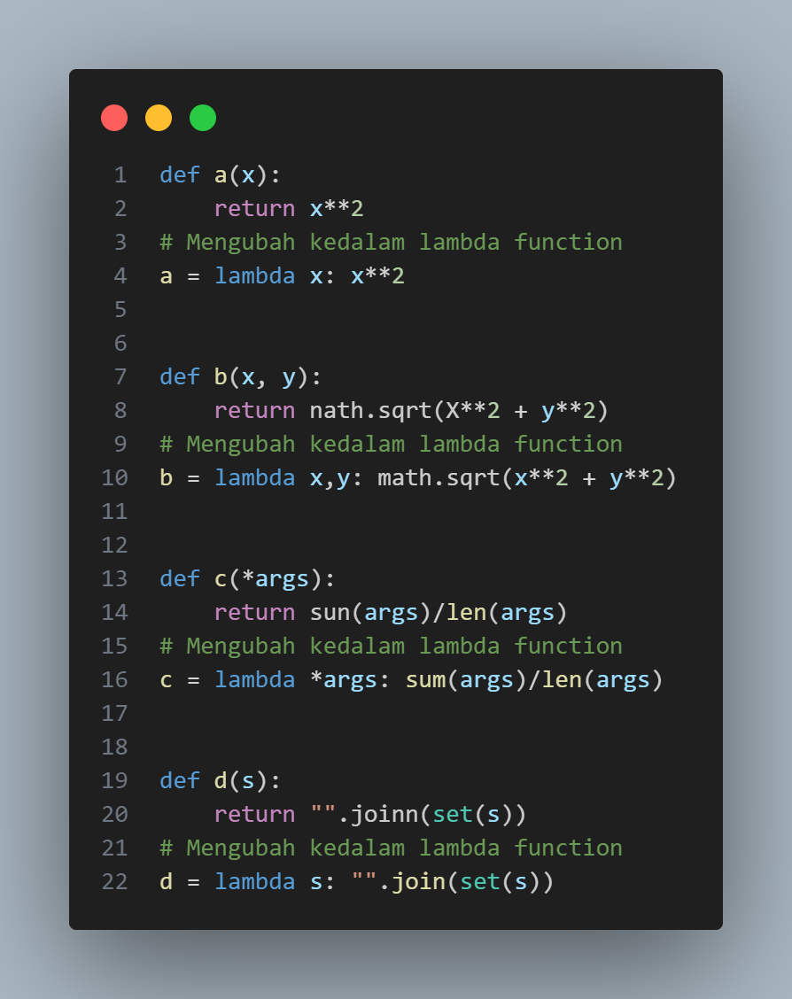
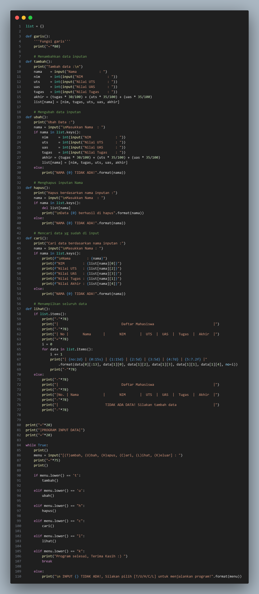

# pertemuan-11
## Latihan 1

 Ubahlah kode dibawah ini menjadi fungsi menggunakan lambda
import math

def a(x):
return x**2

def b(x, y):
return math.sqrt(x**2 + y**2)

def c(*args):
return sum(args)/len(args)

def d(s):
return "".join(set(s))

## Tugas Praktikum

 Buat program sederhana dengan mengaplikasikan penggunaan fungsi yang akan menampilkan daftar nilai mahasiswa, dengan ketentuan:
• Fungsi tambah() untuk menambah data
• Fungsi tapilkan() untuk menampilkan data
• Fungsi hapus(nama) untuk menghapus data berdasarkan nama
• Fungsi ubah(nama) untuk mengubah data berdasarkan nama
• Buat flowchart dan penjelasan programnya pada README.md.

